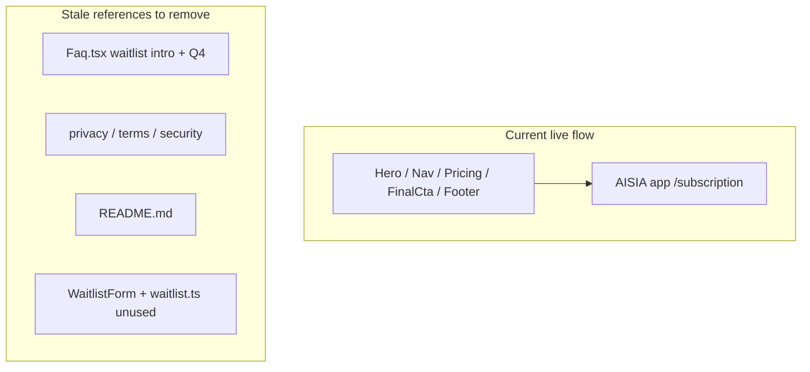

# Marketing Site — Trial-First Alignment Plan

## Current state (important context)

Your review flagged localStorage-only waitlist capture, but the **live code has already pivoted**: all CTAs use `subscriptionUrl()` in [`src/lib/links.ts`](src/lib/links.ts) and link to `{VITE_APP_URL}/subscription?subscribe=1`. [`WaitlistForm.tsx`](src/components/WaitlistForm.tsx) exists but is **not mounted anywhere**.

The real problem is **stale copy** — FAQ, legal pages, README, and the marketing skill still describe a waitlist funnel that no longer exists on the site.



**Email capture for trial-first:** happens in the **AISIA app** at `/subscription`, not on this marketing repo. Before any marketing push, confirm the app subscription flow actually persists emails/accounts (out of scope here, but worth a quick check in `prototype-2`).

---

## 1. Trial funnel messaging alignment (Critical)

### FAQ — [`src/sections/Faq.tsx`](src/sections/Faq.tsx)

| Change | From | To |
|--------|------|-----|
| Section heading | "The five things everyone asks" | **"Common questions"** (timeless) |
| Intro | "the waitlist form is also our fastest inbox" | **"Email us at aisia.io@haibuilt.com"** |
| Q4 answer | waitlist → founding → GA waves | **"Start a 14-day free trial from any CTA — you'll land in the AISIA app to set up your household. Early access continues through 2026; founding annual pricing is available now."** |

**Add 3 new FAQ entries** (expand array to ~8 items):

- **"Is this for individuals or couples?"** — One household subscription covers you and your partner; each person gets private threads plus shared spaces. Solo users are welcome — you don't need a partner to subscribe.
- **"Is the app available now?"** — Yes for early access via the free trial; features roll out in waves through 2026.
- **"How is this different from Day One or Notion?"** — Domain-specific guided threads, AI extraction into artifacts, per-domain canvas, cross-domain conflict detection — reflection with structure, not a blank page or journal.
- **"Does AISIA train on my data?"** — Strengthen existing Q3 answer with an explicit "We do not use your conversations to train models" line (if true per app policy).

### Legal pages — [`src/content/privacy-policy.ts`](src/content/privacy-policy.ts), [`src/content/terms-of-service.ts`](src/content/terms-of-service.ts), [`src/content/security.ts`](src/content/security.ts)

Replace all waitlist/localStorage sections with honest trial-first language:

- **Scope:** marketing site introduces the product and links to the AISIA app for trial signup
- **Data collected on marketing site:** hosting logs + email you send us — **no form submissions stored on this site**
- **Remove** section 5 "Waitlist" from Terms; replace with **"Trial signup"** — clicking a CTA leaves this site for the app; app terms/privacy govern account data
- **Third-party links:** explicitly name the app subscription URL
- Bump `lastUpdated` on all three documents (per [`legal-pages` skill](.cursor/skills/legal-pages/SKILL.md))

### README — [`README.md`](README.md)

Update the outdated section list and "Waitlist behavior" block to describe trial CTAs → app subscription. Remove references to waitlist form in Hero.

### Remove dormant waitlist code

Delete or archive to avoid future confusion:

- [`src/components/WaitlistForm.tsx`](src/components/WaitlistForm.tsx)
- [`src/lib/waitlist.ts`](src/lib/waitlist.ts)

Update [`.cursor/skills/marketing-landing/SKILL.md`](.cursor/skills/marketing-landing/SKILL.md) waitlist rules → trial CTA rules (CTAs link to app; no on-site email form).

### Env var check

Document in README that production deploy must set `VITE_APP_URL` (e.g. `https://app.aisia.io`) so CTAs don't default to `localhost:5180`.

---

## 2. Hero copy rewrite (High)

**File:** [`src/sections/Hero.tsx`](src/sections/Hero.tsx)

| Element | Proposed copy |
|---------|---------------|
| **Headline** | "Every part of your life — **in one clear place**." |
| **Body** | "AISIA — the AI Self Improvement App — is a life operating system for guided reflection. Think through your priorities with AI, extract insights and artifacts, and keep marriage, money, health, and everything else organized. **One subscription covers your household** — you and your partner, with private threads and shared spaces." |
| **Fine print** (below CTA, replaces defensive body ending) | Keep pricing line; add single disclaimer: "Reflection and organization — not professional advice." |

Remove "Not direction. Not professional advice." from the main body paragraph.

---

## 3. Disclaimer consolidation (High)

**Goal:** one clear disclaimer per page, not repeated mid-pitch.

### Home page — keep disclaimer only in Footer

| File | Action |
|------|--------|
| [`Hero.tsx`](src/sections/Hero.tsx) | Remove from body; single line in CTA fine print only |
| [`FinalCta.tsx`](src/sections/FinalCta.tsx) | Remove "Not advice. Not direction." from body |
| [`HowItWorks.tsx`](src/sections/HowItWorks.tsx) | Change mock caption to **"Illustrative mock"** (drop disclaimer) |
| [`Footer.tsx`](src/sections/Footer.tsx) | **Keep** — site-wide canonical disclaimer on every page |

### About page — FAQ + Reflection panel are enough

| File | Action |
|------|--------|
| [`Faq.tsx`](src/sections/Faq.tsx) | **Keep** Q1 — primary user-facing disclaimer |
| [`Reflection.tsx`](src/sections/Reflection.tsx) | **Keep** "What it is not" panel — intentional depth |
| [`Features.tsx`](src/sections/Features.tsx) | **Keep** "Professional-help flags" — feature description, not legal disclaimer |

### Meta

[`index.html`](index.html) — shorten description; drop trailing "Not professional advice." (legal anxiety in SEO snippet).

---

## 4. Section reorder (High)

**File:** [`src/pages/HomePage.tsx`](src/pages/HomePage.tsx)

```tsx
// Before: Hero → Domains → HowItWorks → Pricing → FinalCta
// After:
<Hero />
<HowItWorks />
<Domains />
<Pricing />
<FinalCta />
```

Visitors see the Reflect → Extract → Canvas loop before the eight-domain carousel. Nav anchor order in [`Nav.tsx`](src/sections/Nav.tsx) can stay as-is (out of scope per your nav-label preference).

---

## 5. Define "founding" (High)

**File:** [`src/sections/Pricing.tsx`](src/sections/Pricing.tsx)

Add one sentence to the section `intro`:

> **Founding members** are the first households to subscribe — locking in the lowest rate ever offered ($99/year for life), with direct input on the roadmap.

Optionally add a one-line gloss under the founding tier `note` reinforcing lifetime rate lock.

---

## 6. Bug fix (incidental)

**File:** [`src/sections/Domains.tsx`](src/sections/Domains.tsx) line 99

Remove stray visible text ` What's the weather` after the marquee `</div>`.

---

## Out of scope (deferred to a later pass)

Per your selection: social proof counter, app screenshots, founder bio, contact email change (`hello@aisia.io`), footer tagline, nav "Domains" → "Life areas", pricing deadline, About page rename, Civic & Community domain positioning.

**Note on social proof:** the marketing skill forbids fake counters/testimonials. Once the app captures real signups, a live count can be added via a small API — not in this pass.

---

## Validation

After changes:

1. `npm run build` — typecheck + production build
2. `npm run validate` — deliberate-strategy gate
3. Manual click-through: every CTA opens correct app URL with `?subscribe=1`
4. Read home + about top-to-bottom — no "waitlist" references remain except historical FAQ context if any
5. Confirm disclaimer appears once per page (Footer on home; FAQ Q1 + Reflection panel on about)

---

## Files touched (summary)

| Priority | Files |
|----------|-------|
| Critical | `Faq.tsx`, `privacy-policy.ts`, `terms-of-service.ts`, `security.ts`, `README.md`, delete `WaitlistForm.tsx` + `waitlist.ts`, `marketing-landing/SKILL.md` |
| High | `Hero.tsx`, `FinalCta.tsx`, `HowItWorks.tsx`, `Footer.tsx` (minor), `HomePage.tsx`, `Pricing.tsx`, `index.html`, `Domains.tsx` (bug) |
| Verify | Set `VITE_APP_URL` in production; confirm app `/subscription` captures emails |
